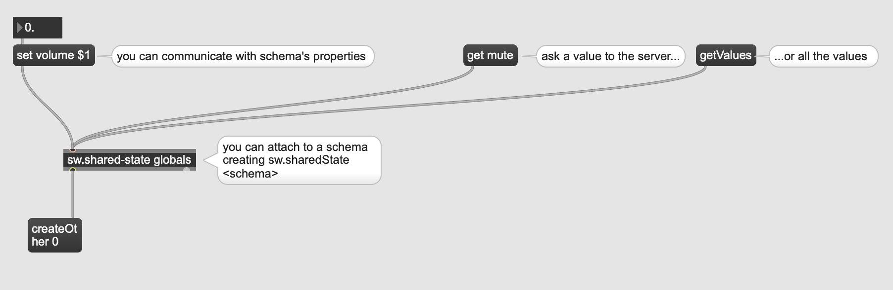

# `@sounworks/state-manager-osc`

> Utility to monitor and control soundworks' shared states within Max using OSC communications



_**Warning**: this component is experimental and will probably be subject to changes_

## Table of Contents

<!-- toc -->

## Installation

### NPM 

```sh
npm install --save @soundworks/state-manager-osc
```

### Max/MSP

1. Download the Max abstraction (SoundworksAPI.zip) from the releases page: [https://github.com/collective-soundworks/soundworks-state-manager-osc/releases](https://github.com/collective-soundworks/soundworks-state-manager-osc/releases)
2. Unzip the package and copy the resulting directory in `~/Documents/Max 8/Packages`
3. Open the Helper patch for more informations

## Usage

### Javascript

```js
import { Server } from '@soundworks/core/server';
import { StateManagerOsc } from '@soundworks/state-manager-osc';

// init the soundworks server as usual
const config = getConfig(ENV);
const server = new Server();
await server.init(config, /* ... */);

// register and create a global schema
const globalsSchema = {
  volume: {
    type: 'integer',
    min: -80,
    max: 6,
    default: 0,
  },
  mute: {
    type: 'boolean',
    default: false,
  },
};

server.stateManager.registerSchema('globals', globalsSchema);
const globals = await server.stateManager.create('globals');

// start the server
await server.start();

// initialize the StateManagerOsc component
const oscConfig = { // these are the defaults
  localAddress: '0.0.0.0',
  localPort: 57121,
  remoteAddress: '127.0.0.1',
  remotePort: 57122,
};

const oscStateManager = new StateManagerOsc(server.stateManager, oscConfig);
await oscStateManager.init();
// now you can control and monitor the `globals` state from your Max patch
```

### Max

See the overview Patch for more information (cf. `~/Document/Max 8/Packages/SoundworksAPI/extras/soundworksAPI.overview.maxpat`)

### Running the example

1. Download the repository
2. Go the `example` directory
3. In a terminal, launch the soundworks application

```
cd path/to/soundworks-state-manager-osc/example
npm install 
npm run dev
```

3. Launch a web client in your favorite browser ([http://127.0.0.1:8000]([http://127.0.0.1:8000]))
4. Open the max example patch `example.maxpat`


## License

BSD-3-Clause
