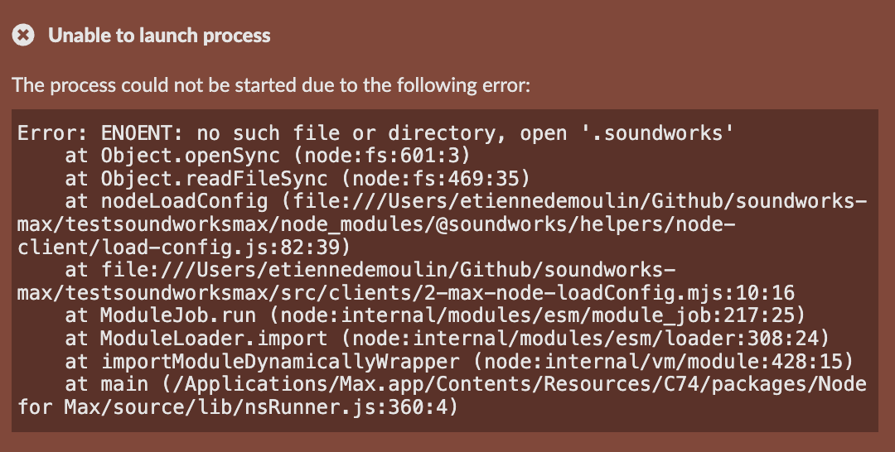
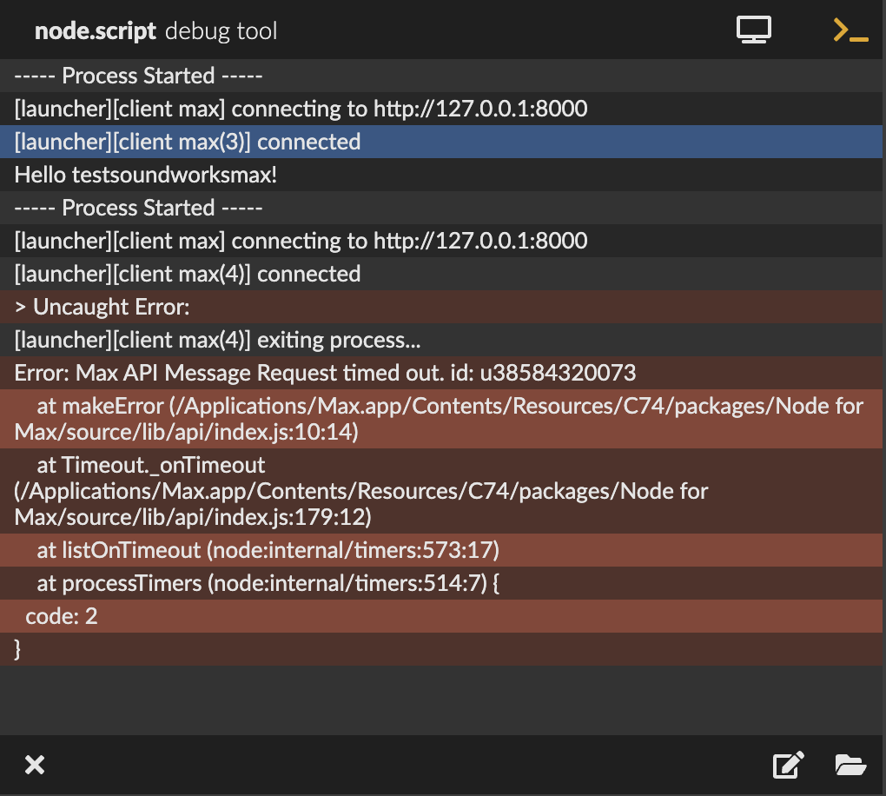

# soundworks | max

Utility to monitor and control soundworks' shared states within [Max](https://cycling74.com/products/max-features).

## No-build version
With Max v9, Cycling added "import" support in Node4Max.  
This means we didn't need anymore to build soundworks-max utility and we can directly run soundworks client in Max.  
What we still need to do in to document well all functionalities and support between Max (& Ableton Live) and Soundworks.   

1. All previous features as to be documented (see below)
2. Create max soundworks clients + max patch on this branch for documented features  
3. List all "bugs" and weird behaviors
4. Create soundworks tutorial with a Max (& Ableton Live) use case  

## Documented features
- Connection status with server
- Change ip and port
- Attach and detach to a state
- Send message in key-value format
- Send message in dict format
- Ask for current values
- Ask for schema definition
- Get updates and values as message
- Get updates and values as dict
- Get and set "event" type as bang
- Work with collections

## Examples on this repo
1. Connected status
This example shows a toggle button on Max indicating if the server is connected or not.
We need to be sure :
  1. Connect client, then connect server
  2. Connect server, then connect client
  3. Disconnect client, then server
  4. Disconnect server, then client
Bug : is there a function to monitor disconnection of the server ? (not working correctly for now)

4. Change IP and port 
Seems to work for now, with hardcoding load config stuff. We will probably have to test it with corrected version.  

5. Attach and detach from a state


## Bugs and weird behaviors
From Max documentation : If you're loading a JavaScript module (.mjs file) you can use top-level await, and loadend will work as expected.  
All examples below will use mjs file format.

### Differences between node client and max client
2. Load Config
js```const config = loadConfig(process.env.ENV, import.meta.url);```


Workaround : hard code config

3. Launcher.execute
js```
launcher.execute(bootstrap, {
  numClients: process.env.EMULATE ? parseInt(process.env.EMULATE) : 1,
  moduleURL: import.meta.url,
});
```  
This is great executed and we can see `[launcher][client max] connected`
Nevertheless when calling a Max function (in our example Max.post to monitor connected status in Max console), Max throw this error


Workaround : move everything inside bootstrap on top level.

## Tutorials


## Credits

[https://soundworks.dev/credits.html](https://soundworks.dev/credits.html)

## License

[BSD-3-Clause](./LICENSE)
